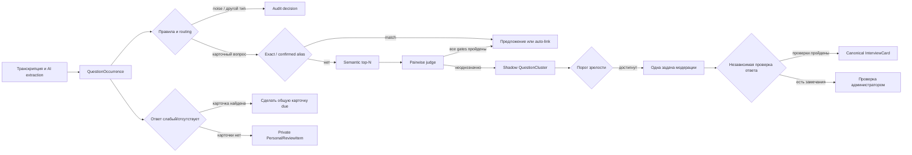
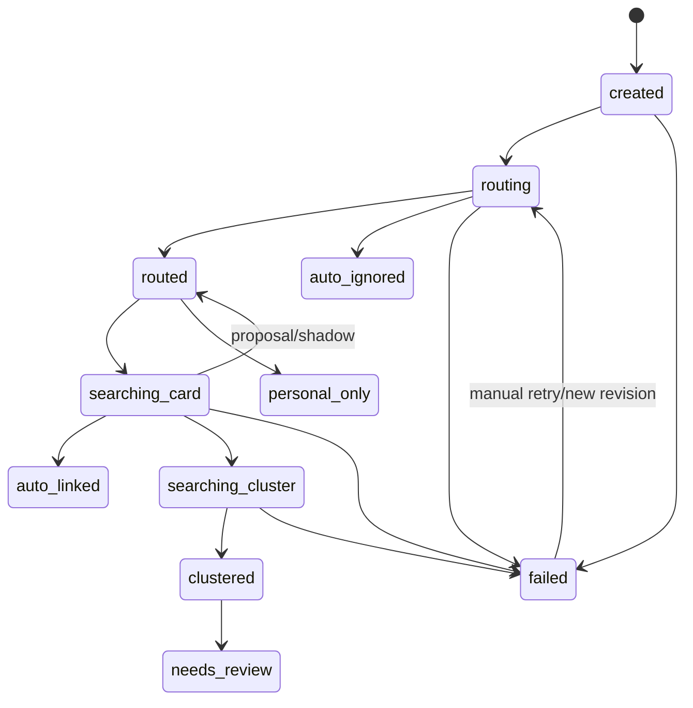

# Автоматизация карточек из AI-разборов

Модуль автоматически публикует новые общие карточки, прошедшие проверку качества, источников и дублей. Спорные случаи остаются в ручной очереди. Он построен поверх существующего AI-разбора, общей колоды карточек и ARQ-очереди.

## Модель данных

Существующая `IntelligenceQuestion` играет роль `QuestionOccurrence`: это одно появление вопроса в конкретном собеседовании. В неё добавлены направление, нормализованный и канонический варианты, контекст, тип учебного объекта, признаки качества, состояние и ревизия автоматизации, ссылка на кластер и объяснение последнего решения.

Новые сущности:

- `QuestionCluster` — теневой смысловой кластер одного направления и одного типа учебного объекта. Хранит агрегаты, приоритет, ревизии состава/статистики, предложение ответа и ручной статус;
- `AutomationDecision` — неизменяемая запись решения правила, AI или человека: кандидаты, оценки, confidence, причина, модель, версии prompt/schema, usage/cost, audit/override;
- `PersonalReviewItem` — приватное обязательное повторение ученика, когда общей карточки ещё нет;
- `CardAutomationSettings` — отдельные безопасные настройки для каждого направления.

`InterviewCard` остаётся единственной канонической общей карточкой. `InterviewCardOccurrence` остаётся источником частотности и имеет ограничения, не позволяющие учесть один вопрос или одну карточку дважды в одном собеседовании. Автоматическая связь не превращает формулировку в доверенный alias: `alias_human_confirmed` выставляется только ручной модерацией.



## Состояния occurrence



Каждая job принимает ревизию сущности. Перед финальной записью worker блокирует строку и проверяет ревизию, поэтому устаревшая job не может затереть ручное изменение. Детерминированный ARQ job id включает функцию, UUID и ревизию. Периодический reconciler повторно ставит незавершённые состояния и кластеры с устаревшей статистикой.

## Правила routing и auto-link

Сначала выполняются дешёвые детерминированные правила. Они отсеивают служебные реплики, HR/организационные вопросы, низкую уверенность транскрипции и вопросы, зависящие от отсутствующего кода/изображения. Остальные коротко классифицирует AI через strict Structured Output. Транскрипция и пользовательский текст всегда помещаются только в секцию untrusted data и не могут менять system instructions.

Поиск общей карточки идёт строго в пределах направления и опубликованных колод/карточек:

1. точное нормализованное совпадение с каноническим вопросом;
2. точное совпадение с формулировкой, которую ранее подтвердил человек;
3. semantic top-N существующим механизмом embeddings;
4. независимый pairwise judge.

Semantic auto-link разрешён только одновременно при:

- допустимом `LearningObjectType`;
- отсутствии критических quality flags;
- совпадении направления;
- similarity не ниже настройки;
- достаточном разрыве между первым и вторым кандидатом;
- ответе judge `same_card`;
- confidence judge не ниже настройки;
- включённом semantic auto-link и выключенном shadow mode.

Ошибка ложного объединения считается хуже пропущенного совпадения. В сомнительном случае occurrence остаётся предложением или попадает в теневой кластер.

## Кластеры и приоритет

Создание кластера сериализуется PostgreSQL advisory lock по узкому ключу `direction:type:normalized`, повторно ищет кластер внутри транзакции и защищено уникальным ограничением. Агрегаты считаются по исходным строкам, а не инкрементами:

- appearances;
- уникальные интервью, компании и ученики;
- уникальные интервью со слабым/отсутствующим ответом;
- первая/последняя дата;
- quality, confidence и воспроизводимый priority score.

В обычном режиме кластер поднимается из shadow в `needs_review`, когда достигнут хотя бы один порог: число уникальных интервью, компаний, слабых ответов либо ручная пометка важности. В рабочем режиме автопубликации подготовка ответа начинается с первого появления вопроса. Повторные появления обновляют одну задачу — отдельная таблица задач на каждое появление не создаётся.

## Answer contract

Для созревшего кластера сильная модель получает только явно разрешённые опубликованные источники того же направления: существующие карточки, статьи базы знаний и материалы роадмапа. Ответ кандидата и сырая транскрипция не являются источниками истины.

Structured Output содержит краткий ответ, обязательные/дополнительные пункты, ошибки, follow-up, уровень, version scope, ссылки на source IDs и confidence. Затем отдельный вызов валидирует поддержку, противоречия и пробелы. Backend повторно проверяет allowlist source IDs. Без источников или подтверждения статус становится `needs_expert_source`/`needs_manual_review`. При включённой автопубликации проверенная карточка создаётся автоматически.

## Личное повторение

Если ответ слабый или отсутствует:

- при найденной общей карточке существующий Anki-progress становится due немедленно;
- без общей карточки и при включённом флаге создаётся ровно один приватный `PersonalReviewItem` на `(student, occurrence)`;
- ученик видит только свои элементы, ментор/админ — только в разрешённом контексте;
- четыре успешных повторения переводят элемент в mastered;
- после ручного или автоматического создания канонической карточки временный элемент архивируется/помечается заменённым.

Личный элемент не влияет на глобальную частотность и не виден другим ученикам.

## Feature flags и безопасные значения

Настройки хранятся в БД отдельно для Python и Go. Исходные значения для ещё не настроенного направления:

- `enabled=false`;
- `shadow_mode=true`;
- все auto-link/auto-ignore выключены;
- `personal_review_enabled=false`;
- `cluster_moderation_enabled=false`;
- `legacy_queue_enabled=true`;
- `global_auto_publish_enabled=false`.

Флаг автопубликации доступен в настройках администратора. Миграция `20260921_0088` включает автоматизацию, рабочий режим, автосвязывание, модерацию кластеров и автопубликацию для существующих опубликованных направлений. Старая очередь остаётся доступной для исключений.
API и БД также запрещают выключить legacy queue, пока одновременно не включены automation и cluster moderation: вопросы не могут остаться без какого-либо пути модерации.

## API и права

Администратор управляет кластерами, bulk actions, настройками и аудитом. Ментор читает только направления, которые ведёт, и выполняет ограниченные review-действия. Ученик получает только собственную очередь личного повторения. Все мутации проверяют ожидаемую версию и записывают audit; конфликт возвращает HTTP 409. Повторная отправка с тем же `Idempotency-Key` не повторяет действие.

Основные маршруты находятся под:

- `/api/v1/admin/card-automation/*`;
- `/api/v1/mentor/card-automation/*`;
- `/api/v1/students/me/personal-review-items/*`.

Администратор сохраняет проверенную формулировку, тему и answer contract отдельно через
`PATCH /api/v1/admin/card-automation/clusters/{cluster_id}/draft`. Запрос требует
`expected_version`, причину и `Idempotency-Key`, попадает в audit и сам по себе не создаёт
общую карточку. Изменение смысла вопроса очищает устаревший embedding, а изменение смысла
или answer contract возвращает ответ в ручную проверку. Создание канонической карточки
остаётся отдельным явным действием администратора через `create-card`.

## Rollout

Перед production-миграцией сделайте резервную копию:

```bash
make prod-backup
make prod-migrate
```

Рекомендуемый порядок для каждого направления отдельно:

1. Оставить automation выключенной, проверить миграцию и старую очередь.
2. Включить `enabled` и `shadow_mode`; auto-link оставить выключенным.
3. Сделать dry-run и небольшой backfill.
4. Сравнить shadow decisions с человеческой разметкой offline evaluation.
5. После приемлемого false-merge rate включить noise/exact/confirmed-alias automation.
6. Несколько дней проверять audit sample и override rate.
7. Отдельно включить conservative semantic auto-link.
8. Отдельно включить личные повторения.
9. Только после проверки включить cluster moderation UI; legacy queue пока оставить.

Примеры:

```bash
make card-automation-backfill CARD_AUTOMATION_ARGS='--direction python --dry-run --batch-size 100'
make card-automation-backfill CARD_AUTOMATION_ARGS='--direction python --unreviewed-only --batch-size 50 --max-ai-requests 200'
make card-automation-evaluate CARD_AUTOMATION_ARGS='--direction python --from-date 2026-07-01 --to-date 2026-08-16'

make prod-card-automation-backfill CARD_AUTOMATION_ARGS='--direction go --dry-run --batch-size 100'
make prod-card-automation-evaluate CARD_AUTOMATION_ARGS='--direction go --from-date 2026-07-01'
```

### Безопасный backfill

Backfill идемпотентен и возобновляем: он обрабатывает данные маленькими batch и ставит revision-aware jobs с устойчивым job key. Флаг `--resume` оставлен явным для runbook, но возобновление безопасно и без него: завершённые состояния больше не выбираются, а повторная постановка ещё не выполненного `CREATED` occurrence дедуплицируется Redis по UUID и revision.

Скрипт выбирает только вопросы со статусом ручной модерации `PENDING`, без публичной карточки и без human-confirmed alias. `APPROVED`, `REJECTED` и `MENTOR_APPROVED` не меняются ни в обычном режиме, ни с `--unreviewed-only`. Dry-run выполняет те же SELECT и подсчёт, но не меняет строки и не обращается к Redis:

```bash
make prod-card-automation-backfill CARD_AUTOMATION_ARGS='--direction python --dry-run --batch-size 100 --max-ai-requests 200'
```

`--max-ai-requests` — консервативный бюджет, а не число occurrence. На один occurrence резервируется восемь запросов: routing + максимум один pairwise judge на каждую из четырёх ARQ-попыток. Поэтому бюджет `200` подготовит максимум `floor(200 / 8) = 25` occurrence и выведет `reserved_ai_requests`. Кэш и rule-only пути обычно уменьшают фактический расход, но не увеличивают резерв.

Боевой бюджетный запуск отклоняется, если для выбранного направления включён `cluster_moderation_enabled`: генерация и валидация answer contract — отдельные AI jobs и иначе смогли бы выйти за этот бюджет. Dry-run остаётся доступным, так как он не создаёт jobs. Оставляйте cluster moderation выключенной до полного опустошения очереди backfill. Это также защищает от её случайного включения до запуска; переключение настройки во время уже выполняющейся очереди остаётся операционным риском, поэтому rollout нужно выполнять последовательно.

### Повторная классификация кластеров без темы

Для уже созданных кластеров используйте отдельную команду. Она не трогает опубликованные карточки, вопросы с ручным решением и подтверждённые человеком aliases. По умолчанию команда работает в dry-run и только показывает объём работ:

```bash
make prod-card-automation-reprocess-missing-topics \
  CARD_TOPIC_REPROCESS_ARGS='--direction python'
```

Для первого боевого запуска оставьте `shadow_mode` включённым и задайте небольшой AI-бюджет:

```bash
make prod-card-automation-reprocess-missing-topics \
  CARD_TOPIC_REPROCESS_ARGS='--direction python --execute --max-ai-requests 160'
```

На один occurrence консервативно резервируется до 16 AI-запросов с учётом повторной маршрутизации, сравнения кандидатов, генерации ответа и возможных повторных попыток. Бюджет `160` поэтому поставит в очередь не более 10 occurrences; фактический расход обычно меньше. Кластер всегда переносится целиком и не разрезается границей бюджета.

По умолчанию повторно обрабатываются кластеры без широкой темы или с темой, которой нет среди опубликованных карточек этого направления. Чтобы дополнительно переобработать кластеры с корректной широкой темой, но без детальной подтемы, добавьте `--include-missing-subtopics`:

```bash
make prod-card-automation-reprocess-missing-topics \
  CARD_TOPIC_REPROCESS_ARGS='--direction python --include-missing-subtopics'
```

Перед `--execute` automation должна быть включена, а `shadow_mode` — оставаться включённым до опустошения созданной очереди. `intelligence-ai-worker` должен работать. Дождитесь завершения batch перед следующим запуском и повторяйте небольшие запуски, пока dry-run не покажет `prepared_occurrences: 0`. Для уже кластеризованных вопросов не используйте старый `prod-card-automation-backfill`: он предназначен для первоначальной обработки occurrence.

### Offline evaluation без утечки ground truth

Evaluation является строго read-only: выполняет только `SELECT`, не вызывает OpenAI, не строит embeddings и не создаёт `AutomationDecision`. Человеческая разметка определяется так:

- `APPROVED` со ссылкой на ранее существовавшую карточку — `existing_card`;
- `APPROVED`, создавший legacy-карточку `ai-{question_id}` — `new_card`;
- `REJECTED` — историческая метка отклонения;
- `APPROVED` без сохранившейся карточки исключается из знаменателей и отражается в `excluded_examples`.

Для каждого примера используется временной срез на момент `admin_reviewed_at` (с безопасным fallback на `updated_at`/`created_at`):

- карточка должна быть создана не позднее человеческого решения и оставаться опубликованной в текущем snapshot;
- карточка `ai-{question_id}`, созданная из самого примера, всегда исключается из кандидатов;
- alias должен быть подтверждён человеком строго раньше решения, а текущий occurrence не может быть собственным доказательством;
- saved automation decision учитывается только если он создан строго до human label и его source не `HUMAN`;
- post-label decisions и aliases не используются.

Это предотвращает распространённую ошибку, когда evaluator «угадывает» правильную карточку только потому, что проверяемый вопрос уже был к ней привязан человеком. Exact canonical и prior-confirmed alias воспроизводятся правилами. Semantic auto-link оценивается только при наличии сохранённого pre-label pairwise decision; CLI не подменяет отсутствующий judge эвристикой. Если решения нет, система честно `abstain`, а ближайший локальный/embedding-кандидат используется только для объяснения примера false split.

Пример запуска и сохранения отчёта:

```bash
make prod-card-automation-evaluate CARD_AUTOMATION_ARGS='--direction python --from-date 2026-01-01 --to-date 2026-08-16 --error-limit 100'
```

`--to-date` включителен целиком в UTC. JSON-отчёт содержит:

- число загруженных, оценённых и исключённых примеров;
- auto-link coverage/precision/recall;
- false merge и false split rate;
- noise precision/recall;
- cluster purity;
- ручные задачи до и оценку задач после automation;
- предполагаемое сокращение очереди;
- долю совпадения сохранённого topic prediction с human category;
- количество реально оценённых saved semantic decisions;
- количество human cluster split решений и перенесённых ими occurrence;
- до 50 (или `--error-limit`) примеров false merge, false split, ошибок noise и topic с вопросом, выбранной/правильной карточкой, similarity, judge, confidence и причиной.

Оценка `estimated_manual_tasks_after` консервативна: сохранённые pre-label cluster decisions используются как есть, а без них unresolved вопросы группируются только по точной нормализованной формулировке. Она не выдаёт желаемый semantic clustering за измеренный результат. `cluster_purity` считается по human card labels внутри этих unresolved clusters.

Ограничения исторической разметки:

- старая очередь не хранила структурированную причину отказа, поэтому `REJECTED` является proxy для noise/non-card и noise-метрики нужно проверять по примерам;
- старый интерфейс мог перезаписать исходный текст отредактированной формулировкой, если отдельная исходная версия тогда не сохранялась;
- история публикации карточек/колод не версионировалась, поэтому evaluator использует текущий published snapshot плюс исторический `created_at`;
- без сохранённого pre-label pairwise результата CLI измеряет точный/alias baseline, но не заявляет качество semantic judge.

Для решения о включении semantic automation используйте выборку, в которой shadow mode успел сохранить pairwise decisions до ручной модерации. Если `saved_semantic_predictions_evaluated = 0`, false merge rate ещё не доказывает безопасность semantic режима.

## Метрики и контроль качества

API метрик показывает объём routing, exact/alias/semantic links, созданные/promoted clusters, личные элементы, ручные задачи на 100 интервью, возраст очереди, override/false-merge/noise false-positive rate и среднюю стоимость на интервью/вопрос/кластер.

Token usage сохраняется всегда. Для денежной оценки задайте актуальные цены настроенных моделей через `OPENAI_LIGHT_INPUT_PRICE_PER_MILLION_USD`, `OPENAI_LIGHT_OUTPUT_PRICE_PER_MILLION_USD`, `OPENAI_ANALYSIS_INPUT_PRICE_PER_MILLION_USD` и `OPENAI_ANALYSIS_OUTPUT_PRICE_PER_MILLION_USD`. Нулевые значения намеренно оставляют `cost` неизвестной, а не выдают ложную оценку; цены не зашиты в код, потому что меняются независимо от релиза платформы.

Перед включением следующего режима проверяйте:

- false merge и reviewed override rate;
- ошибки классификации noise;
- долю решений без достаточного score gap;
- рост AI cost;
- возраст `needs_review`;
- количество `failed` occurrence и stale revisions.

Для включения semantic auto-link требуется репрезентативный pre-label shadow-набор и `false_merge_rate <= 0.01`. Нулевая ошибка на наборе без `saved_semantic_predictions_evaluated` не считается прохождением этого gate.

## Ручной retry и troubleshooting

1. Найдите occurrence/cluster в UI и прочитайте `automation_error` и последнее audit decision.
2. Убедитесь, что для направления включена automation, а `intelligence-ai-worker` и Redis healthy.
3. Используйте ручной reprocess из API/UI: он увеличивает ревизию и создаёт новый уникальный job id.
4. Не меняйте статус строк напрямую: это обходит optimistic locking и audit.
5. Если budgeted backfill остановлен сообщением про `cluster_moderation_enabled`, выключите только cluster moderation для выбранного направления, дождитесь завершения уже запущенных answer jobs и повторите dry-run.
6. Если evaluation показывает `examples=0`, проверьте период, slug направления и наличие финальных `APPROVED`/`REJECTED` human labels. Если semantic count равен нулю, сначала накопите shadow decisions, а не включайте semantic auto-link по exact-only метрикам.

Полезные команды:

```bash
docker compose -f infra/docker-compose.yml --env-file .env ps
docker compose -f infra/docker-compose.yml --env-file .env logs --tail=200 intelligence-ai-worker
make test-backend
make test-frontend
make lint
make typecheck
```

Ошибки AI с retryable-признаком получают ограниченный exponential backoff. Невалидный или исчерпавший retries результат переводит сущность в явный `failed`/`needs_manual_review`, а не оставляет её «подвисшей».

## Удаление и rollback

При удалении AI-разбора или трека собеседований сервис сначала определяет затронутые карточки/кластеры, удаляет карточные occurrence, архивирует личные элементы, а после каскада пересчитывает частотность и статистику. Подтверждённая каноническая карточка не удаляется.

Для application rollback сначала выключите automation и оставьте legacy queue. После остановки новых jobs можно вернуть предыдущий backend/frontend. Downgrade миграции удаляет только добавленные структуры/поля, поэтому перед ним обязательно нужен backup; результаты automation после downgrade будут потеряны. Не используйте `docker compose down -v`.

## Тестирование

```bash
make ensure-test-db
cd backend && poetry run pytest
cd backend && poetry run ruff check app tests
cd backend && poetry run mypy app
cd frontend && pnpm test
cd frontend && pnpm lint
cd frontend && pnpm typecheck
cd frontend && pnpm build
```

Особенно важны сценарии exact/alias, score gap, related-but-different scope, singleton shadow, promotion по независимым интервью, retry/idempotency, параллельное создание кластера, личное повторение, удаление/пересчёт и границы доступа.

## Автопубликация и накопленная очередь (0088)

В рабочем режиме с `global_auto_publish_enabled=true` первое появление карточного
вопроса запускает подготовку ответа, без ожидания нескольких интервью. Кластеры
из накопленной очереди подхватывает существующий периодический reconciler:
он продвигает старые shadow/candidate, восстанавливает генерацию/валидацию и
публикует уже проверенные ответы. Миграция также возвращает неприменённые теневые
предложения без ручного решения на маршрутизацию. Уже отклонённые, опубликованные,
отложенные и отредактированные человеком вопросы автоматически не пересматриваются.

Условия публикации: самостоятельный технический вопрос, уверенность routing,
ответа и независимой проверки не ниже 0.9; отсутствие критических флагов,
неподтверждённых утверждений, противоречий, пропущенных обязательных пунктов и
непроверенных версионных утверждений. Источники повторно проверяются по текущим
опубликованным материалам направления. Автоматически созданные карточки не
используются как доверенный источник для следующих генераций. Ответ кандидата
и черновик AI-фидбека не являются доказательством корректности ответа.
Если содержимое источников изменилось со времени проверки, ответ проходит
независимую валидацию повторно перед публикацией.

Перед записью проверяются актуальные настройки, ревизия и ручные решения.
Повторные jobs не создают вторую карточку. Публикации одного направления
сериализуются, выполняется повторный поиск дублей: точное совпадение связывается
с существующей карточкой, подозрительное смысловое совпадение уходит на проверку.
Колода и широкая тема выбираются только из существующих опубликованных материалов;
неоднозначное назначение тоже остаётся человеку.

Карточка, связи с исходными вопросами, частотность, замена личных повторений и
запись аудита создаются в одной транзакции. Решение имеет источник `rule`,
не заполняет поля администратора и не делает формулировки подтверждёнными
человеком aliases. `audit_sample_percent` задаёт долю для последующей проверки;
выборочный аудит не блокирует публикацию.

Для запуска применить `alembic upgrade head` и обновить API, worker и frontend.
Миграция включает обработку накопленной очереди; внешний AI вызывается только
воркерами, не внутри миграции. Выключение флага или включение теневого режима
останавливает новые публикации, уже созданные карточки сохраняются.

## Согласованные источники и восстановление проверок

Генерация сохраняет `answer_source_ids` в аудите. Независимая проверка загружает
эти материалы по идентификаторам; изменение ранжирования не выкидывает источники
ответа. Для старых ответов без такого списка сначала загружаются явно указанные
`source_references`, затем добавляются результаты поиска. Все материалы проходят
прежние проверки направления, публикации и доверия. Автоматически созданные
карточки, скрытые и удалённые материалы не становятся доверенными из-за ссылки.

Перед публикацией загружается тот же набор, что использовала проверка, и
сравнивается хеш его текущего содержимого. Изменение текста или доступности
материала требует повторной проверки; одно изменение ранжирования — нет.
Отсутствующие ссылки обнаруживаются до платного вызова модели.

Reconciler восстанавливает до 50 старых проверок за проход в направлениях с
включённой автопубликацией. Критерий — `needs_expert_source` и точный диагностический
флаг `Контракт ссылается на непереданные источники.` в `unsupported_claims`.
Если все ссылки доступны и предварительные условия публикации выполнены,
сбрасывается только результат проверки: сам ответ сохраняется и повторно не
генерируется. Решения человека не пересматриваются. Каждая проверенная старая
ошибка получает аудит `source_repair_version=1`; недоступные материалы и другие
причины отказа остаются на ручном рассмотрении без циклических платных попыток.

В списке кластеров отдельно отображаются «Обрабатывает AI» и «Нужно решение
человека». По умолчанию выбран второй фильтр. Счётчики учитывают доступные
пользователю направления и остальные фильтры, но не пагинацию. Автообновление —
раз в 15 секунд. API: `processing_only` для автоматической обработки,
`needs_action_only` для ручной очереди; при обоих флагах приоритет у первого.

При восстановлении очереди готовые ответы выбираются раньше новых генераций.
Массовое продвижение старых shadow/candidate приостанавливается для направления,
пока там есть незавершённая автоматическая обработка ответов. Пересчёт изменённых
кластеров и обработка новых интервью продолжаются. Уже поставленные задания Redis
не удаляются и не переставляются; ограничение не устраняет внешние rate limits.

Для этих исправлений обновить backend, `intelligence-ai-worker` и frontend.
Новая миграция не требуется. Восстановление старых ошибок начнётся при следующем
проходе reconciler после обновления worker, с обычными проверками перед публикацией.

### Повторная проверка наличия материалов (0089)

Кластеры без источников и без черновика не конкурируют с основной очередью AI.
Отдельная локальная проверка (до 50 за проход) повторяется не чаще раза в 6 часов
на кластер. Найденные материалы возвращают его в обычную генерацию; отсутствие
материалов не вызывает AI. Пауза сохраняется в `source_retry_after` и действует
также на ранее поставленные автоматические задания. Явный запуск черновика
модератором может обойти эту паузу. Нужна миграция `20260922_0089`.

## Очередь после исследования 22 сентября 2026

Ошибки квоты, авторизации, соединения, rate limit и 5xx после исчерпания коротких
повторов переводят ответ в `waiting_for_ai`, а не в ручную модерацию. Сохранённый
ответ и замечания не удаляются. Reconciler возвращает до 50 таких кластеров за
проход после `ai_retry_after` (через час), только в активных направлениях и без
ручных решений. Продолжение выбирается по сохранённому этапу: генерация, проверка
готового ответа или исправление отклонённого черновика.

После ошибки квоты Redis приостанавливает запросы на час для всего API-ключа,
включая другие модели; ключ хранится как хеш. В течение паузы запросы не
отправляются провайдеру и не считаются платными вызовами. Одновременные уже
начавшиеся запросы остановить этим механизмом нельзя. Обычный rate limit сохраняет
отдельную паузу на модель с Retry-After. Ожидание AI также удерживает массовое
продвижение старых теневых кластеров данного направления.

Новый фильтр `waiting_only` и счётчик `waiting_for_ai_total` отделяют ожидание
сервиса от ручной очереди и активной AI-обработки. При нескольких флагах фильтра
приоритет: ожидание, обработка, ручная очередь. Детализация показывает причину
квоты и время следующей попытки, а также сохранённые содержательные замечания.

Подбор источников использует полнотекстовый поиск PostgreSQL по заголовкам и
содержимому, русским словоформам и техническим терминам. Ранжирование выполняется
по всему допустимому корпусу перед LIMIT, заголовки имеют больший вес. Служебные
слова вопроса отбрасываются. Поиск не вызывает AI. Правила направления,
публикации и происхождения материала, а также привязка источников по ID сохраняются.

Reconciler рассматривает до 20 отклонённых ответов за проход. Если источники есть,
предварительные условия выполнены и нет решения человека или явного отсутствия
контекста, ставится `repair_pending`. Генератор получает предыдущий ответ,
замечания и актуальные источники; старый ответ сохраняется до успешной замены.
Разрешены максимум два исправления на кластер (`answer_repair_attempts`), после
каждого нужна независимая проверка. Кэш включает предыдущий ответ и замечания.
Неподходящие кандидаты перепроверяются не чаще раза в шесть часов. Старые ответы
с `supported=true`, остановленные оговоркой о версии, сначала перепроверяются по
новой политике без перегенерации. Невосстановимые контексты и неоднозначные дубли
остаются человеку.

`version_warnings` содержит подтверждённые границы применимости и информационные
оговорки; `version_sensitive_claims` — неустранённые проблемы, которые мешают
публикации. Старые проверки не переинтерпретируются как разрешение: перед
автопубликацией требуется проверка текущей версии промпта и текущих источников.
Новый `question_is_self_contained` подтверждает, что вопрос пригоден для
самостоятельной карточки; отсутствие кода/данных для конкретной задачи означает
отказ. Неуверенность транскрибации, снизившая confidence до 0,50, не запрещает
создание учебной карточки, если независимая проверка подтвердила её самостоятельность
и остальные барьеры пройдены. Исходная уверенность, роли и оценка ответа кандидата
не изменяются. Низкая уверенность без признака такой неопределённости и критические
флаги по-прежнему блокируют публикацию.

Для вопросов о личном опыте генератор формирует явно обозначенный шаблон с
заполняемыми фактами, не утверждения о выдуманном опыте ученика. Необязательные
советы без подтверждения источниками предлагается удалить при исправлении.

Внедрение: остановить старые процессы backend и intelligence-воркеров, применить `alembic upgrade head`
(миграции 0089 и 0090), обновить backend, оба intelligence-worker и frontend,
затем запустить обновлённые процессы. Не оставлять старые процессы с прежним enum после миграции.
0090 переносит только актуальные технические отказы накопленной очереди в ожидание,
сохраняет историю и ответы, исключает закрытые кластеры и ручные решения. Первый
автоматический повтор — не раньше часа после миграции. Сначала устранить квоту,
оплату или лимит у провайдера; перезапуск воркера сам по себе квоту не исправляет.
Внешних AI-вызовов внутри миграции нет. При откате статусы ожидания/исправления
возвращаются в ручную очередь; добавленные значения PostgreSQL enum остаются
неиспользуемыми для безопасного отката без пересоздания типа.
