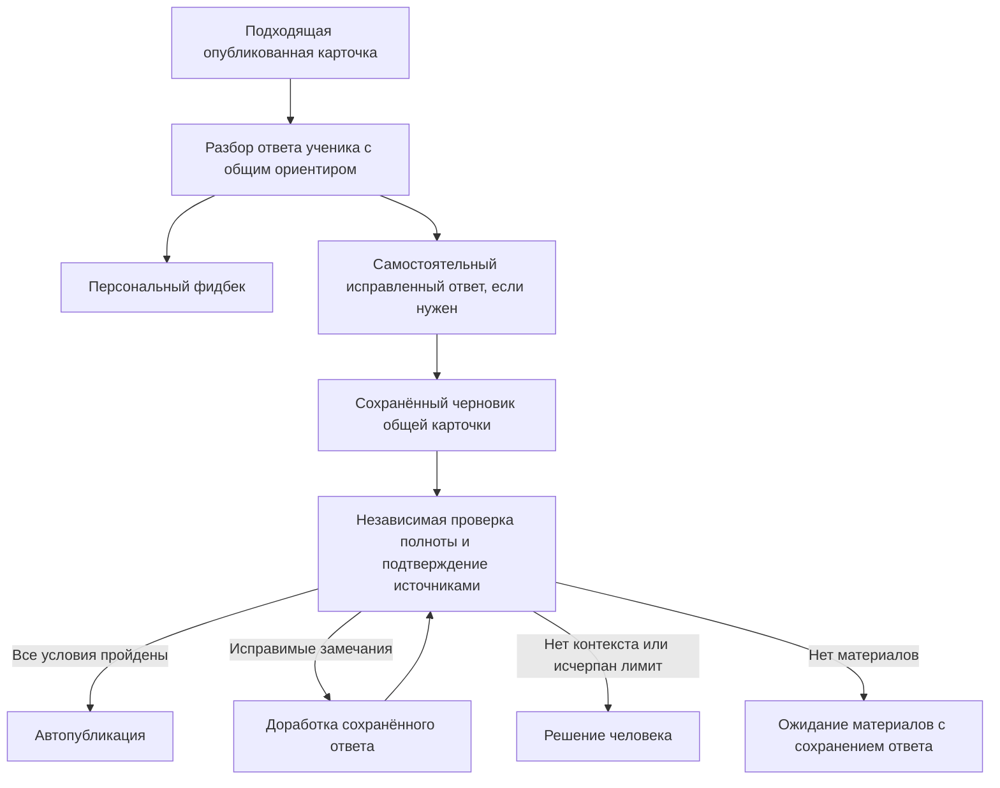

# Переиспользование ответов между разборами и карточками

Исправления сделаны в локальном `mentoring-platform`. Коммит, push, деплой,
изменения рабочей базы и платные AI-вызовы не выполнялись.

Удалены три причины потери уже готового ответа: отключение переноса при создании
кластера с автопубликацией, отключение переноса в worker генерации и удаление
черновика без ссылок при пересчёте статистики. Сам ответ AI не стал доверенным
источником: он проходит проверку по прежнему набору разрешённых материалов.

Полный черновик обходится без отдельной генерации. При отсутствии подходящего
ответа остаётся обычная генерация; при неполном черновике — ограниченное исправление.
Для повторного использования опубликованного эталона в разборе применено точное,
однозначное совпадение в том же направлении. Семантическое сопоставление вопросов
продолжает работать в существующей автоматизации карточек.

Валидация возвращает `supporting_source_references`. Worker проверяет, что все
идентификаторы действительно были переданы, и добавляет ссылки только после
успешной проверки содержательности, самостоятельности вопроса и отсутствия
блокирующих замечаний. Уверенность и остальные условия автопубликации не ослаблены.
Перестановка того же набора источников не вызывает повторную платную проверку;
изменение их содержимого продолжает требовать новой проверки.

Добавлены интеграционные сценарии: публикация сохранённого текста без генерации,
сохранение черновика при пересчёте, передача исходного ответа и замечаний на ремонт,
отказы при недостающих/посторонних ссылках, личных утверждениях и противоречиях,
сохранение черновиков в автоматическом режиме, изоляция опубликованных эталонов
и изменение ключа кэша при редактировании эталона. Отдельно проверены реальные
форматы запросов провайдера с синтетическими SDK-ответами.

Проверки: 225 backend-тестов и 39 UI-тестов прошли; Ruff, mypy для изменённых
backend-модулей, TypeScript и ESLint для изменённых UI-файлов — без ошибок.

Тесты запускаются на временных PostgreSQL-базах с суффиксом `_test`, UI — в локальном
frontend-контейнере. Они проверяют поведение приложения, но не являются оценкой
точности новых инструкций на живой модели или измерением расходов production.
Для изменения не нужна миграция; порядок обновления и поведение существующей
очереди описаны в [документации модуля](../card-automation.md).
