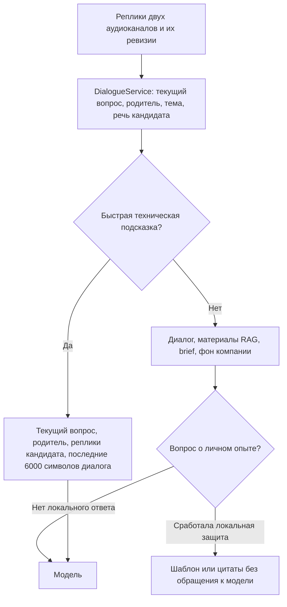

# Аудит помощника на собеседовании — 23 сентября 2026

Последующие исправления и повторные проверки описаны в [отчёте об исправлениях](copilot-quality-fixes-2026-09-23.md). Ниже сохранены результаты исходного состояния до этих изменений.

Помощник действительно формирует контекст и на проверенных сценариях умеет отделять новую тему, возвращаться к старой и учитывать исправленное условие. Но утверждать, что он стабильно даёт естественные и точные ответы во всех режимах, нельзя. Подтвердились две существенные проблемы: потеря подготовленных фактов при переполнении контекста и служебные, иногда нерелевантные ответы в ветке личного опыта. В коротких технических подсказках остаётся риск чрезмерного упрощения.

Это аудит **текущего локального кода**, включая уже имевшиеся незакоммиченные изменения `mentoring-copilot`, а не проверка версии на production. Код помощника в этом задании не менялся. Изменения интерфейса проверки карточек находятся в `mentoring-platform`; [отдельная приёмка](card-review-completion-2026-09-23.md).

## Что проверено

- Репозиторий платформы: HEAD `30e2cd14`; Copilot: HEAD `cc9092c`, рабочее дерево с изменениями. Версия реально использованных промптов: `p7-4dfedcf27ab70273`.
- 187 существующих тестов Copilot: сохранённый диалог, ревизии распознавания, уточнения, возврат к теме, подготовка, RAG, отмена, сроки генерации, повторные запросы, автоматизация и потоковый контракт ответа. Все прошли. STT/LLM в этих тестах подменены: это проверка механики, не качества языка.
- Дополнительно 17 тестов интеграции на стороне платформы прошли на отдельной временной PostgreSQL: источники подготовки, RAG, права, интервью и установщики. Два устаревших ожидания desktop scope исправлены в тестах; разрешения приложения не расширялись.
- 14 специально выбранных синтетических сценариев. Семь прошли через настоящий `DialogueService` и `ContextBuilder` с временной SQLite; семь проверяют явно сконструированные контексты и границы. Затем те же контексты прошли через реальный `OpenAILLMGateway`: 10 обращений к настроенной модели и 4 локальных ответа без AI. Каждый сценарий выполнен один раз.
- Модель облачных ответов — `gpt-5.6-sol`; профили локальной конфигурации: `sol_simple` для быстрых подсказок и `sol_low` для обычных ответов. Быстрые подсказки в конфигурации включены. Повторы транспорта для аудита отключены; ограничения длительности ответов сохранены.
- Только вымышленные вопросы и опыт. Рабочая база, интервью учеников, реальные документы и аудио не использовались. Секреты в результатах не сохранены.

Полные входы, фактически отправляемые текстовые контексты, ответы, usage и оценка каждого случая: [JSON](copilot-quality-2026-09-23.json). Воспроизводимый [runner](copilot_quality_audit.py) по умолчанию работает без платных запросов; `--live` явно включает ограниченный прогон провайдера.

Результаты разобраны Codex по пяти критериям: соответствие вопросу, удержание контекста, отсутствие выдуманной биографии, пригодность для устной речи, сохранение технических условий. Это **не независимая оценка людьми и не процент качества на реальных интервью**. В выбранной выборке: 7 сценариев без существенных замечаний, 3 с частичными замечаниями, 4 с существенными недостатками.

## Как формируется контекст

Код: `mentoring-copilot/services/interview-api/app/dialogue/service.py`, `rag/context_builder.py`, `sessions/answers.py`, `llm/gateway.py`, `llm/prompt_registry.py`.

В семи воспроизведённых диалогах:

- При переходе Redis → FastAPI/Django старый Redis отсутствовал в переданном контексте.
- При возврате Redis → Kafka восстановился исходный вопрос о Kafka и соответствующая реплика кандидата; промежуточный Redis исключён.
- Разорванное условие «миллион строк, три значения» + «поможет ли индекс?» стало одним вопросом.
- Исправление «канал без буфера» → «канал с двумя оставшимися значениями» заменило старое условие; ответ учёл именно два значения.
- Утверждение кандидата «GIL защищает от всех гонок» было исправлено, а не повторено как истина.

Это хорошие признаки работоспособности контроллера диалога. Они не доказывают устойчивость к произвольному шумному аудио, ошибочно выбранным устройствам, двум голосам в одном канале или всем формулировкам нового вопроса. В этом прогоне проверены текстовые события после распознавания, а не качество живой транскрибации.

## Подтверждённые проблемы и приоритеты

### P1. Личный опыт обходит промпт живой речи

`grounded_experience()` вызывается до `PromptRegistry.compose()` и при наличии ответа сразу завершает генерацию. Поэтому улучшенный промпт разговорной речи здесь вообще не применяется.

Вопрос: «Что конкретно ты делал в проекте Каталог?» При двух разрешённых фактах результат начинался:

> Можно опереться на эти подтверждённые тобой фрагменты:

Далее идут цитаты и технические идентификаторы фактов. Это полезная справка для подготовки, но не фраза, которую удобно произнести на собеседовании. При вопросе о зарплатных ожиданиях эта же ветка просила уточнить **роль и фактический результат**, хотя недостающий факт — желаемая зарплата.

В сценарии личного уточнения кандидат уже сказал, что реализовал повторные попытки обработки сообщений. Эта реплика попала в `said_by_candidate`, но локальный ответ её проигнорировал и закончил указанием уточнить цифру, которой вопрос вообще не требовал.

**Исправление:** отделить справку о происхождении фактов от текста ответа; формировать связную речь строго из выбранных разрешённых фактов. Когда фактов нет, показывать короткое сообщение именно о недостающем параметре. Реплики кандидата использовать как утверждения в текущем разговоре, без повышения их статуса до независимо проверенной биографии. Нельзя лечить это разрешением модели придумывать опыт.

**Приёмка:** вопросы о роли, метриках, зарплате, конфликте и мотивации; никаких новых работодателей, чисел или обязанностей; согласованные факты представлены естественно; отсутствие зарплаты не вызывает подсказку про роль.

### P1. Подготовленный контекст может исчезнуть при обрезке

В обычном `AnswerContext.prompt_data()` разделы соединяются в строку, после чего применяется `[:32000]`. `brief` добавляется **после** фона компании, состояния диалога, транскрипта, предыдущего ответа и найденных материалов.

В сценарии `long_context` при заполненном допустимом контексте `brief` полностью отсутствовал в итоговом тексте: контрольный ID `synthetic-role` не дошёл до модели. Модель ответила общим примером, хотя подготовленные сведения существовали. Это воспроизведённый сценарий границы; частота такого случая в production не измерена.

**Исправление:** выделить отдельные бюджеты разделам; гарантировать место текущему вопросу, исправлениям, родителю и релевантным фактам. Сначала сокращать фон компании, нерелевантные источники и старые ответы. Учитывать токены и фиксировать, какие разделы сокращены. Простое увеличение лимита повышает стоимость и откладывает повторение ошибки.

**Приёмка:** переполнение каждым разделом отдельно и совместно; обязательные факты и последние отрицания/числа остаются целыми; бюджет не превышен; модель не получает оборванный JSON как будто это полный brief.

### P2. Быстрый режим выигрывает в задержке ценой персонализации

Быстрый путь для технического вопроса намеренно исключает RAG, brief, компанию и импортированные сведения старого ответа. В его инструкции и JSON нет отдельного уровня кандидата или этапа интервью. Поэтому наличие проверенных карточек в платформе само по себе не означает, что быстрые аудиоподсказки их используют.

Это осознанная оптимизация, а не ошибка сама по себе. Но обещание пользователю «ответы учитывают твою подготовку» нуждается в уточнении режима. Для вопроса с существенными личными или проектными ограничениями нужен обычный контекст; для общеизвестной теории быстрый режим оправдан.

**Исправление:** явное правило выбора режима, компактные ограничения уровня/этапа там, где они влияют на ответ; проверка, что уточнения по источнику или проекту не ошибочно проходят как обезличенная теория. Не возвращать тяжёлый поиск к каждому простому вопросу.

### P2. Ограничение в 25 слов иногда делает ответ слишком категоричным

На вопрос об индексе быстрый ответ сохранил важную мысль, что три различных значения не задают их частоты. Но начал с «Индекс поможет только для редких значений». Это слишком абсолютное правило: в PostgreSQL есть, например, чтение по покрывающему индексу с условиями применимости, которые не сводятся к редкости значения. [Документация PostgreSQL](https://www.postgresql.org/docs/current/indexes-index-only-scans.html).

При продолжении мысли о кэше ответ повторил пользу кэша и добавил формальное «требует продуманного обновления», вместо конкретного следующего действия с категориями. При этом развёрнутое сравнение Kafka/RabbitMQ получилось заметно естественнее: один пример интернет-магазина, выбор по задаче, без выдуманного опыта.

**Исправление:** оценивать короткие ответы по сохранению существенного условия, а не только по длине. Добавить контрпримеры к «всегда/никогда/только», продолжение уже начатого ответа и проверки смены версий технологий. При необходимости разрешать дополнительную короткую фразу вместо ложного обобщения. Ещё одно общее указание «пиши естественно» слабее набора проверяемых сценариев.

Ответы о чтении закрытого канала соответствовали проверяемой семантике: сначала содержимое буфера, затем нулевое значение и `ok == false`. [Спецификация Go](https://go.dev/ref/spec#Receive_operator). Вывод о том, что GIL не заменяет необходимую синхронизацию программы, согласуется с документацией о потоках; отдельные free-threaded сборки также требуют учитывать режим исполнения. [Документация Python](https://docs.python.org/3/library/threading.html).

## Задержка и устойчивость

Все 10 облачных вызовов этого прогона завершились. Первый непустой текст: минимум **0,864 с**, медиана **1,600 с**, максимум **2,336 с**. Для шести быстрых подсказок диапазон — **0,947–2,226 с**. Это время от вызова gateway до первого текста, **без аудиозахвата, STT, ожидания конца вопроса, очереди сервера, RAG и доставки в Electron**. Его нельзя называть полной задержкой подсказки или сравнивать напрямую с рекламной «секундой» другого сервиса.

Сообщённый usage: 17 576 входных и 737 выходных токенов. Четыре локальных ответа исключены из оценки облачной задержки. Стоимость в деньгах и p95 по десяти разнородным запросам не оценивались.

Тесты подтверждают ряд защит от устаревших событий, повторов и смены условий. Реальный часовой разговор, смена аудиоустройства, сон ОС, плохая сеть и качество Windows-захвата в этом аудите не проверялись. Старые отчёты соседнего проекта не выдаются за повторную приёмку текущей сборки.

## Сравнение с аналогами

Срез публичных сайтов и документации на 23 сентября 2026. У конкурентов не покупались подписки и не запускался одинаковый тестовый набор; поэтому ниже сравнение **подтверждённых публичных возможностей**, а не рейтинг качества ответов. Заявления о точности, незаметности и скорости без собственных измерений не принимаются как доказательства.

| Инструмент | Контекст и персонализация по публичным материалам | Формат помощи | Что следует для нашего продукта |
|---|---|---|---|
| Наш Copilot | Привязанные к источникам реплики, ревизии, brief с фактами, материалы платформы, история компании; есть быстрый путь с сокращённым контекстом | Короткая подсказка и отдельное углубление, работа с кодом/экраном | Сильная связь с обучением и проверенными материалами. Проверяемость уже есть в коде; сначала устранить потерю фактов и служебные персональные ответы. |
| GhostGPT | На официальной странице заявлены контекст разговора, транскрибация, распознавание спикеров и задачи со снимка | Ручной вызов подсказки; теоретические и технические вопросы | Ориентир для простого сценария вызова. Публичных данных недостаточно для оценки качества русского языка, длительного удержания контекста и подтверждения биографии. Не путать с одноимённым общим чат-сервисом ghostgpt.org. [GhostGPT](https://ghostgpt.tech/) |
| sobes.tech | Профили контекста, PDF-резюме, технологии, дополнительные сведения; на главной также заявлены общий контекст речи/снимков/текста и поиск по личным заметкам | Настройки длины, формата, первого лица; технические и поведенческие ответы | Наиболее прямой ориентир по явным настройкам контекста и речи. Нам полезнее показывать, какие материалы реально участвуют, чем добавлять ещё один непрозрачный переключатель. [Контекст](https://docs.sobes.tech/docs/manual/context), [возможности](https://sobes.tech/en) |
| Final Round AI | Goal: роль, компания, этап, резюме, вакансия и заметки | Автоматическое обнаружение вопросов, ответы от первого лица, практика, разбор после сессии и Screen Help | Ориентир для единой подготовки под конкретную вакансию. Наша связь с треком и менторским фидбеком может дать преимущество, если эти сведения не теряются при сборке контекста. [Interview Copilot](https://www.finalroundai.com/interview-copilot) |
| Interview Coder | Заявлены транскрибация аудио и помощь в технических интервью, включая алгоритмы и system design | Технический desktop-помощник | Имеет смысл сравнивать на одних и тех же задачах, уточнениях требований, ревью кода и крайних случаях; качество не выводится из списка функций. [Официальный сайт](https://www.interviewcoder.co/) |
| Cluely | Заявлены контекст текущего разговора и экранная помощь; позиционирование шире собеседований | Ответ по горячей клавише, заметки и следующие действия | Ориентир по простоте получения помощи в моменте. Специализацию на Python/Go и персональных фактах нужно оценивать отдельно. [Официальный сайт](https://cluely.com/) |

У GhostGPT обычное текстовое извлечение страницы показывало только навигацию; функции дополнительно прочитаны из публичной страницы в Chrome после выполнения JavaScript. Полные рекламные тексты в отчёт не копировались. Недоступность конкретной возможности в публичной документации не означает её отсутствия в продукте.

На текущих доказательствах нельзя честно утверждать, что наш помощник лучше или хуже перечисленных сервисов по точности или естественности речи. Видно другое: нам уже доступны контекст и материалы, которые можно проверять по источникам, но две ветки обработки мешают использовать их последовательно. До добавления новых функций я бы исправлял именно их.

## Следующая приёмка качества

1. Исправить два P1 и добавить негативные тесты: служебная речь при наличии фактов, неправильный fallback для зарплаты, потеря brief при большом RAG/диалоге.
2. Повторить сохранённые 14 кейсов минимум трижды; добавить короткие уточнения, исправления чисел/отрицаний, возврат после 20–30 реплик и варианты неидеальной транскрибации.
3. Попросить двух менторов независимо оценить анонимизированные синтетические ответы: точность, релевантность, произносимость, ненужные повторы, неподтверждённые утверждения. Сейчас этой независимой оценки нет.
4. Для настоящего сравнения сервисов подать один набор разрешённых синтетических интервью в тестовые аккаунты; фиксировать версии, настройки, первый полезный текст и ответ целиком. Одинаковый сценарий важнее рекламного списка моделей.
5. Отдельно пройти разговорный аудиосценарий 45–60 минут на поддерживаемых ОС. Это проверит полный путь до подсказки, которого текстовый прогон не измеряет.

Деплой, публикация сборок, изменение production-настроек и регистрация аккаунтов у конкурентов не выполнялись.
